<p align="center">

</p>
 
<h2>Installing osTicket on a Windows 10 Virtual Machine</h2>

<h2>What is osTicket</h2>

<t>osTicket is an open-source help desk and ticketing system that lets organizations manage customer support requests by converting emails, phone calls, or web form submissions into organized, trackable tickets.</t>
<h2>About this Project</h2>
In this project we will install and deploy osTicket on a Windows 10 virtual machine including it’s prerequisite files and dependencies within Azure.

<h2>Environment & Technology Used</h2>

- Microsoft Azure Virtual Machine 
- Microsoft Windows 10
- Remote Desktop
- PHP
- MySQL

<h2>Prerequisites</h2>

- osTicket-Installation-Files.zip
- PHPManagerForIIS_V1.5.0.msi
- rewrite_amd64_en-US.msi
- php-7.3.8-nts-Win32-VC15-x86.zip
- VC_redist.x86.exe
- mysql-5.5.62-win32.msi
- HeidiSQL

<h2>Getting Started</h2>

<h3>1. Create a Windows 10 Virtual Machine in Azure with the following settings & credentials:</h3>

- VM Name: vm-osTicket
- Operating System: Windows 10 22H2-X64
- Size: 4vCPUs, 32GB Ram (for better performance)
- Username: labuser
- Password: osTicketPassword1!

>[!NOTE]
>_Please refer to  [MS Azure Virtual Machines](https://github.com/pmaglana/azure-active-directory) for detailed instruction on how to create VMs._
      
>[!CAUTION]
>_It is NOT good practice to be putting passwords like this in plain/readable text in any documentation. Best practice is to use a password manager to store passwords, such as KeePass, LastPass, or NordPass. Passwords will continue to be listed in these documents for ease of use, and for training purposes only._</mark>

<h3>2. Log into the Virtual machine with Remote Desktop</h3>

- Make sure that your Azure VM is running, paste it's public IP at Remote Desktop, click Connect, then enter the username and password above, hit OK.
- Within the vm-osTicket, download the [osTicket-Installation-Files.zip](https://drive.google.com/file/d/1YsiGAyLoOjtVyXyeYBJzAu5XdtiGBu0I/view?usp=sharing) and unzip it onto your desktop. The folder should be called “osTicket-Installation-Files”. We will use the files in this folder to install osTicket and some of the dependencies.
<details><summary>See screenshots</summary>
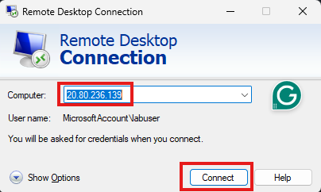
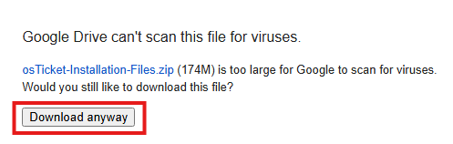
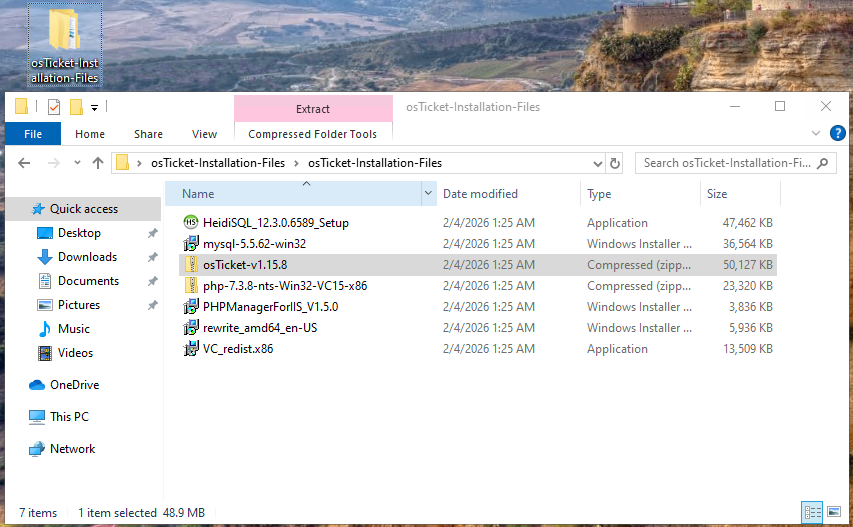
</details> 

<h3>3. Enable IIS in Windows with CGI</h3>

- At the start menu, search for "Turn Windows features on or off". The Windows Features box will pop up. Click + sign on Internet Information Services to expand. Click + on World Wide Web Services to expand. Then, click + on Application Development Features, and lastly tick the CGI checkbox, and hit OK. *(In some cases IIS Management Console needs to be installed too. To do this, just expand Web Management Tools & check IIS management Console)*
- After windows is finished with the installation click the Close button.
<details><summary>See screenshots</summary>
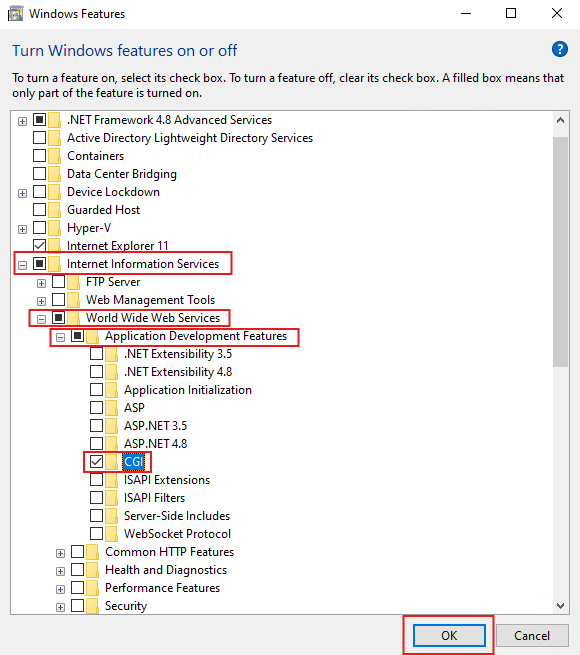
</details> 

<h3>4. Extract PHP 7.3.8 on C:\PHP</h3>

- From the “osTicket-Installation-Files” folder, unzip PHP 7.3.8 by right-clicking on the file named ```php-7.3.8-nts-Win32-VC15-x86.zip```, click Extract All..., and at the Destination path textbox type in C:\PHP, then click Extract.
<details><summary>See screenshots</summary>
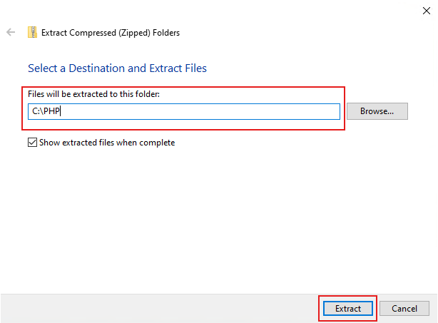
</details> 

<h3>5. From the “osTicket-Installation-Files” folder, install the following Prerequisite files, make sure to accept its agreemements and use the default settings.</h3>

- Install PHP Manager ```PHPManagerForIIS_V1.5.0.msi```.
<details><summary>See screenshots</summary>
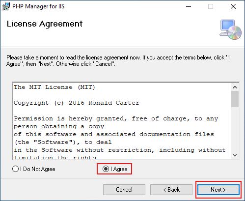
</details>

- Install the Rewrite Module ```rewrite_amd64_en-US.msi```.
<details><summary>See screenshots</summary>
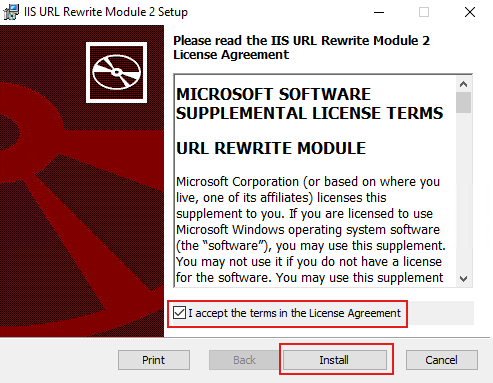
</details>

- Install ```VC_redist.x86.exe```

<details><summary>See screenshots</summary>
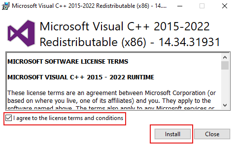
</details>

- Install ```mysql-5.5.62-win32.msi``` with the following setup:
    * Typical Setup
    * Launch Configuration Wizard
    * Standard Configuration
    * Username: root
    * Password: root
<details><summary>See screenshots</summary>
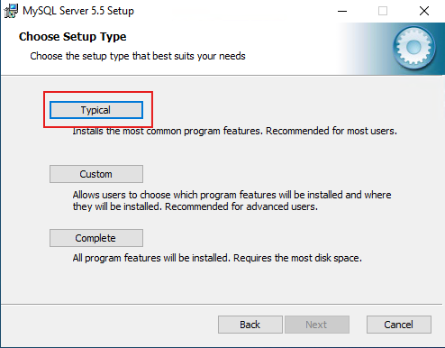

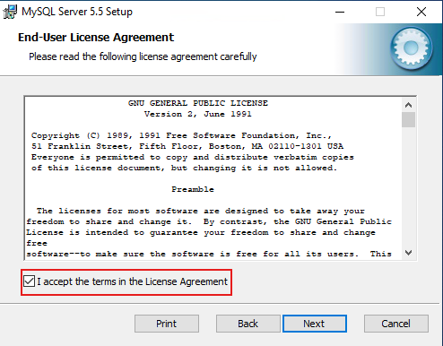
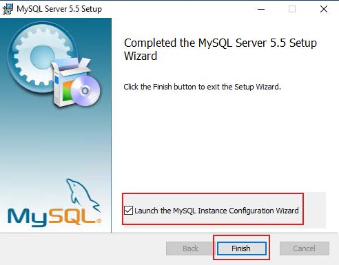
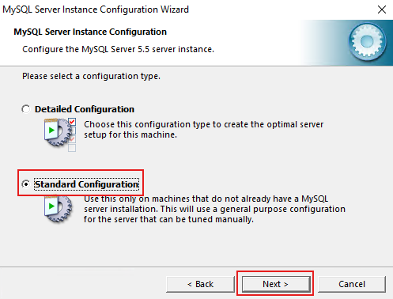

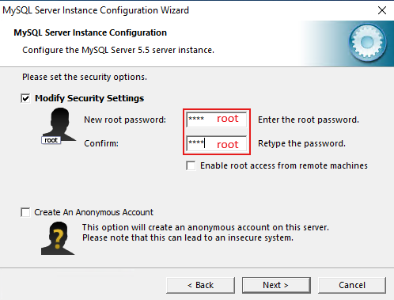
</details> 

<h3>6. Open IIS as an Admin, Register PHP, and Reload IIS.</h3>

- Click the Start button and search Internet Information Services(IIS), then click "Run as administrator".
<details><summary>See screenshots</summary>
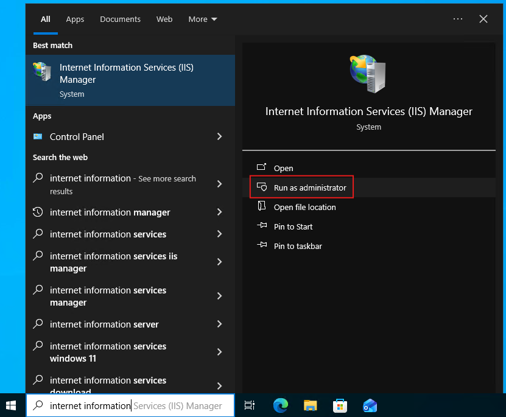
</details>

- Register PHP from within IIS by double clicking PHP Manager, click Register new PHP version and navigate to folder C:\PHP\php-cgi.exe, and hit OK to complete the process.
<details><summary>See screenshots</summary>
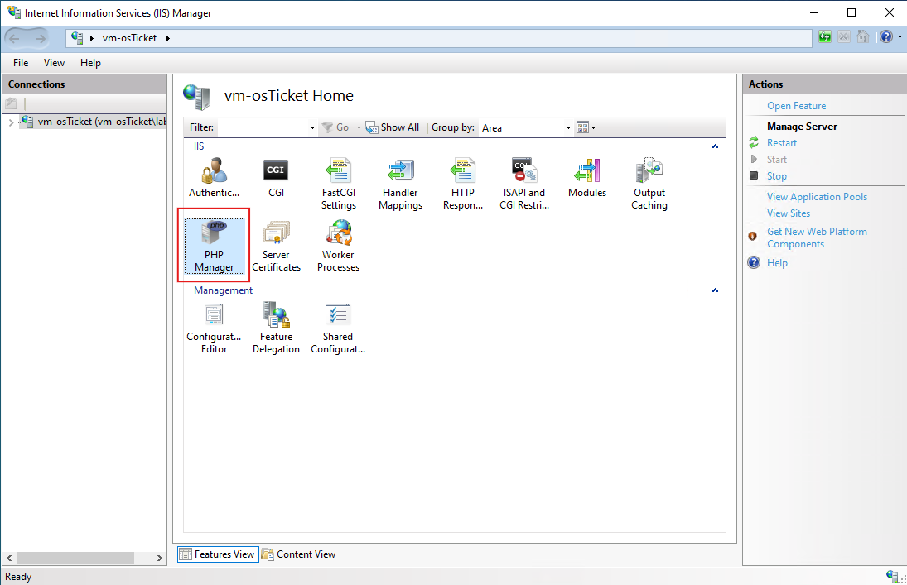
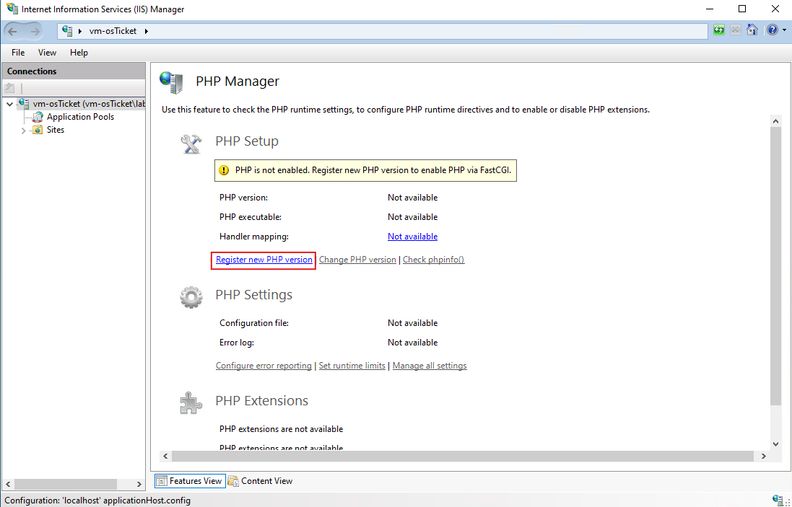
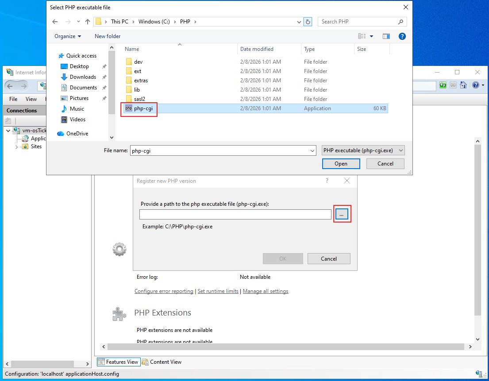
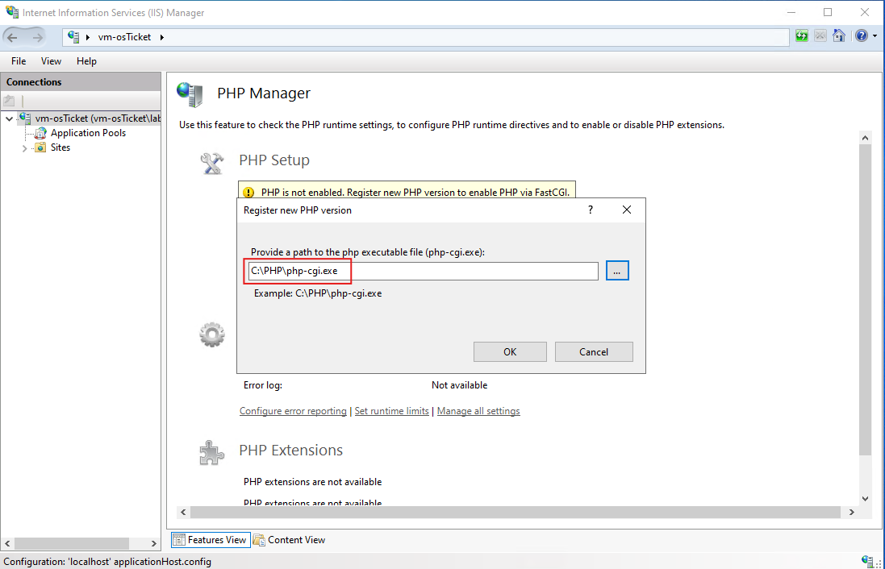
</details>

- To Reload IIS, head to the Actions panel in the IIS manager then Click Stop, and after a couple of seconds click Start.
<details><summary>See screenshots</summary>
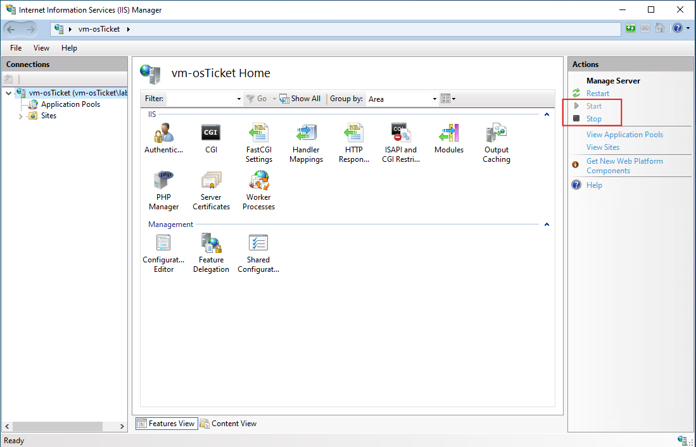
</details> 

<h3>7. Install osTicket v1.15.8.</h3>

- From the “osTicket-Installation-Files” folder, unzip “osTicket-v1.15.8.zip”.
- Copy the “upload” folder into “c:\inetpub\wwwroot”.
- Within “c:\inetpub\wwwroot”, Rename “upload” to “osTicket”.

<details><summary>See screenshots</summary>

</details> 

<h3>8. Reset/Reload IIS.</h3>

- To Reload IIS, open Internet Information Services(IIS), then click "Run as administrator".
- Head to the Actions panel in the IIS manager then Click Stop, and after a couple of seconds click Start.
  
<details><summary>See screenshots</summary>

</details> 

<h3>9. Loading osTicket Site.</h3>

- At the IIS Manager window, go to Sites > Default Web Site> osTicket. And On the right panel, click “Browse *:80”
  
>[!NOTE]
>_Some extensions are not enabled. Do the following steps to enable them._
- Go back to IIS, Sites -> Default -> osTicket
- Double-click PHP Manager
- Click “Enable or disable an extension”  
    * Enable: php_imap.dll
    * Enable: php_intl.dll
    * Enable: php_opcache.dll
- Refresh the osTicket site in your browser, observe the changes

<details><summary>See screenshots</summary>

</details> 

<h3>10. Renaming, Removing/Adding Permission to ost-sampleconfig.php & finalizing osTicket setup.</h3>

- Open Explorer, go to this path: C:\inetpub\wwwroot\osTicket\include\ost-sampleconfig.php
- Right-click and Rename ost-sampleconfig.php to ```ost-config.php```.
- To remomve permission, right-click ost-config.php, select Properties -> Security tab -> Advanced, click Disable Inheritance and Select Remove all.
- And on the same window, lets add Permission by clicking Add button, Select Principal, type "Everyone" on the object name, hit OK, tick Full control, hit OK, click Apply then OK to close the window.
  
>[!CAUTION]
>*Assigning "Everyone" permissions to ost-config.php is for training/learning environment only. Permissions should be restricted after setup in real environments.*

- Head back to the osTicket web browser and click Continue button located at the buttom part of the page and Enter these settings:
    * Helpdesk Name: Your Name
    * Default Email: Your email
    * First name: Your FN
    * Last Name: Your LN
    * Email Address: *should be diff from default email*
    * Username: adminuser
    * Password: Password123!

<details><summary>See screenshots</summary>

</details> 

<h3>11. Installing HeidiSQL and configuring the Database. </h3>

- From the “osTicket-Installation-Files” folder, install ```HeidiSQL_12.3.0.6589_Setup.exe``` with the default settings, click launch and Finish to close the window.
- From HeidiSQL Session manager window click +New to create a new session, use ```root``` for User and Password, then click Open.
<details><summary>See screenshots</summary>

</details> 

- A new window pops-up, rightclick Unnamed *(dolphin icon)*, select Create new then click Database.
<details><summary>See screenshots</summary>

</details> 

- At the Create database window, type ```osTicket``` at the Name textbox, and click OK.
<details><summary>See screenshots</summary>

</details> 

- Continue Setting up osTicket in the browser and click the "Install Now" button after entering the following credentials:
    * MySQL Database: osTicket
    * MySQL Username: root
    * MySQL Password: root
<details><summary>See screenshots</summary>

</details> 

<h2>Finishing Up</h2>
<h3>Congratulations for successfully installing osTicket. Listed below are the links for the Admin and User login page.</h3>

- Help desk login page: *http://localhost/osTicket/scp/login.php*
- End Users osTicket URL: *http://localhost/osTicket/*
<details><summary>See screenshots</summary>

</details> 

<sub>*Having issues and trouble installing osTicket, please reach out to paulo@maglana.com*</sub>


